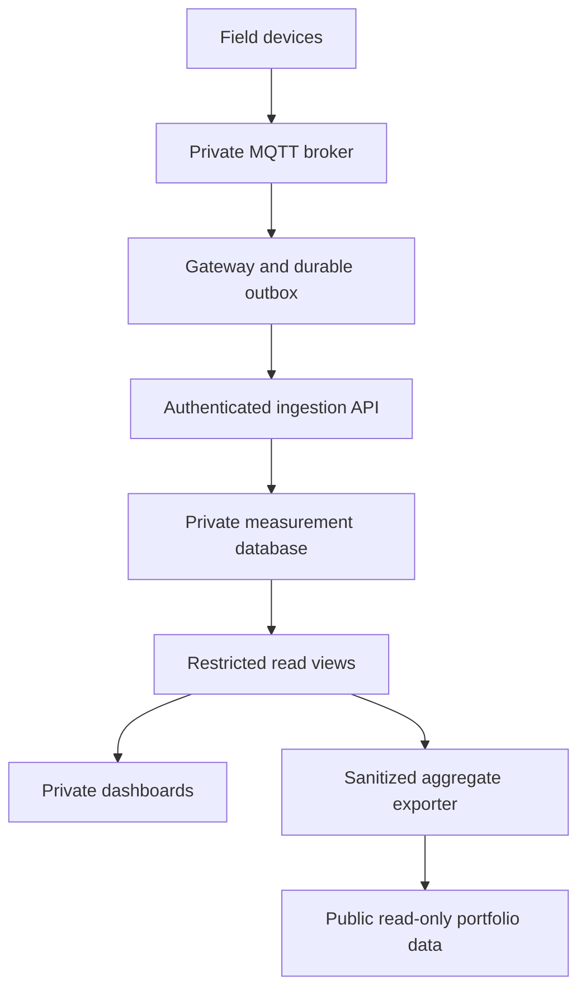

# Authenticated ingestion design

Status: proposed architecture. No ingestion endpoint, database, service account, or network exposure is created by this change.

## First implementation

Keep collection private. Field devices publish to the local MQTT broker; a gateway service on the NAS validates and batches readings. It sends batches to a dedicated ASP.NET Core ingestion service over the trusted LAN or Tailscale. Use HTTPS even on the private network. Keep this service separate from the public portfolio and its email handler.



The public site receives a curated export. It never receives database credentials, management tokens, or a route to Portainer, the MQTT administration plane, Node-RED's editor, or Ollama. Publish aggregated values only after deciding what location, timing, occupancy, and device information is safe to disclose. An exporter initiates outbound delivery; public-site compromise must not create an inbound administrative path.

## Identity and authorization

- Give each gateway its own random 256-bit opaque bearer credential over TLS. Never share one credential across gateways or put it in browser JavaScript.
- Store the credential on the gateway as a mounted secret with restrictive file permissions. Store only its SHA-256 digest and metadata server-side. High-entropy random credentials do not need human-password hashing, but digest comparisons must be constant-time.
- The credential record contains credential ID, gateway ID, permitted device IDs, scope (`measurements:write`), expiry, revoked status, and creation/rotation timestamps.
- Resolve identity from the credential. Treat every device ID in the body as untrusted and check it against that identity's allowlist. A gateway can write only for its assigned devices and cannot read measurements or administer devices.
- Require expiry (initial policy: 90 days). Rotate with a short overlap, verify the replacement works, then revoke the old credential. Revocation must take effect promptly; any auth cache must have a documented short TTL.
- Operators use separate authenticated accounts for provisioning and revocation. Do not reuse gateway credentials for management or human login.
- MQTT also requires authentication and topic ACLs per device/gateway. A gateway token does not secure the preceding sensor-to-broker hop. Separate untrusted IoT devices from administration networks.

Tailscale restricts reachability; API authentication and per-device authorization still apply. If public ingestion is later required, expose only the ingestion service through a separately controlled ingress, add edge quotas, and consider mTLS. Do not expose databases or management interfaces to achieve it. Browsers must not be ingestion clients, and CORS is not an authentication mechanism.

## Contract

Proposed `POST /v1/measurements/batches`, JSON only, with `Authorization: Bearer <gateway credential>` and a UUID `Idempotency-Key`.

```json
{
  "schemaVersion": 1,
  "batchId": "6cf9f4a0-55bc-4bf0-aade-c347c96d9001",
  "events": [
    {
      "eventId": "139ae991-00f0-4d39-8aa6-c2d750018daa",
      "deviceId": "greenhouse-sensor-01",
      "observedAt": "2026-09-16T12:00:00Z",
      "metric": "soil_moisture",
      "value": 42.1,
      "unit": "percent",
      "quality": "good"
    }
  ]
}
```

Initial limits to validate against actual sampling rates:

| Control | Initial policy |
| --- | --- |
| Body | 64 KiB streamed maximum, reject unsupported compression |
| Batch | 1–100 events, reject unknown properties and unsupported schema |
| Metrics | Server-maintained allowlist of metrics, units, value types and ranges per device |
| Time | UTC timestamps; maximum 5 minutes future skew and 7 days backfill; store received time separately |
| Volume | 60 requests/minute and 6,000 events/minute per gateway, plus deployment-wide storage and ingestion budgets |
| Duration | 10-second request deadline and bounded database command timeouts |
| Identity | Valid, unexpired, unrevoked credential with write scope for every device in the batch |

Reject non-finite numbers, oversized strings, invalid UUIDs and timestamps, and batches containing unauthorized devices. Keep the full batch atomic; do not silently accept only some events. Use parameterized database operations. No client-selected SQL, table names, filesystem paths, or URLs to fetch.

## Persistence, retries and replay

Use MariaDB for the initial durable intake ledger, with an ingestion-only database user granted the minimum required operations. Use unique constraints on `(gateway_id, batch_id)` and `(gateway_id, event_id)` and record a normalized payload hash. Persist the idempotency record and readings in the same transaction.

- Return `201` only after durable commit. Return the original receipt for an identical retry; return `409` when the same ID has different content.
- The gateway persists its outbox before sending and deletes entries only after a confirmed durable receipt. After timeouts or retryable failures, retry the same IDs using exponential backoff and jitter; respect `Retry-After`.
- Bound the gateway outbox by disk size/age, alert before capacity, and explicitly record any dropped data. Never silently discard oldest measurements.
- A later worker can project the durable ledger to InfluxDB using checkpointing and deduplication. Do not require simultaneous writes to MariaDB and InfluxDB to succeed in one request.
- Retain deduplication records for at least the permitted replay/backfill horizon. Idempotency prevents duplicates; it does not protect a stolen credential from submitting new IDs. Expiry, revocation, TLS and quotas address that risk.

Use `400` for malformed data, `401` for invalid credentials, `403` for denied device/scope, `409` for conflicting retries, `413` for oversized requests, `429` for quotas, and `503` for temporary storage failure. Return generic errors and a request ID, never stack traces or database details.

## Read access and operations

Use a separate read-only database identity for dashboards/export. Public export is a whitelist of approved aggregates, not a generic database query API. Keep raw data and configuration behind authenticated private access. AI summaries consume a restricted read view and have no management credentials or authority to execute commands from sensor content.

Log request ID, credential ID (not the token), gateway, event count, status, duration, and rejection reason. Exclude authorization headers, secrets, and raw payloads. Alert on repeated authentication failures, rejected devices, quota hits, queue growth, and missing expected readings. Define retention and test backup restoration before depending on the data.

## Acceptance gate before implementation goes live

1. Test missing/expired/revoked credentials and attempts to write another gateway's devices.
2. Test replay, conflicting IDs, concurrent duplicate delivery, database outage, and gateway restart while offline.
3. Prove throttling across multiple service instances, not just a process-local counter.
4. Test malformed/oversized/compressed payloads, invalid metrics, timestamp skew, and SQL-injection-like strings.
5. Confirm public clients cannot reach intake, raw storage, or management services, and that exported data cannot reveal private fields.
6. Exercise credential rotation/revocation and restore a backup. Record measured storage and throughput requirements before raising limits.

References: [OWASP API security risks](https://owasp.org/API-Security/editions/2023/en/0x11-t10/), [OWASP REST security guidance](https://cheatsheetseries.owasp.org/cheatsheets/REST_Security_Cheat_Sheet.html).
